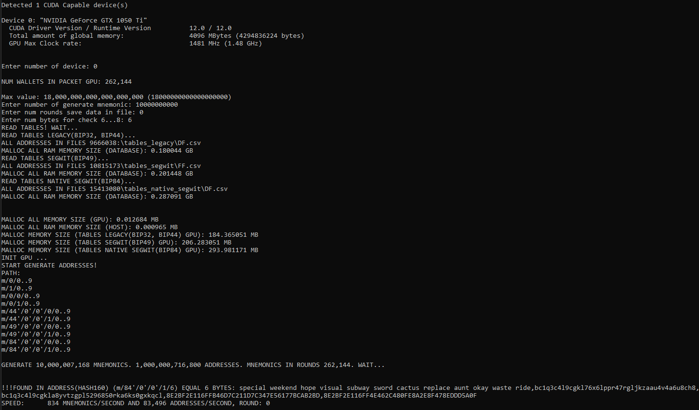

# Brute-force Mnemonic Bitcoin on GPU(CUDA)  
## (Version 1.2)
## Генерация мнемонических фраз Bitcoin и соответствующих приватных ключей адресов m/0/x, m/1/x, m/0/0/x, m/0/1/x, m/44'/0'/0'/0/x, m/44'/0'/0'/1/x, m/49'/0'/0'/0/x, m/49'/0'/0'/1/x, m/84'/0'/0'/0/x, m/84'/0'/0'/1/x. Поиск адресов в базе.

## Файл config.cfg
 * ***"folder_tables_legacy": "F:\\tables_legacy"***  - путь к папке с таблицами адресов Bitcoin Legacy(BIP32, BIP44). Адреса в таблицах должны быть в формате hash160 и отсортированы программой https://github.com/Houzich/Convert-Addresses-To-Hash160-For-Brute-Force.
 * ***"folder_tables_segwit": "F:\\tables_segwit"***  - путь к папке с таблицами адресов Bitcoin Legacy(BIP49). Адреса в таблицах должны быть в формате hash160 и отсортированы программой https://github.com/Houzich/Convert-Addresses-To-Hash160-For-Brute-Force.
* ***"folder_tables_native_segwit": "F:\\tables_native_segwit"***  - путь к папке с таблицами адресов Bitcoin Native SegWit(BIP84). Адреса в таблицах должны быть в формате hash160 и отсортированы программой https://github.com/Houzich/Convert-Addresses-To-Hash160-For-Brute-Force.
* ***"num_child_addresses": 10*** - количество генерируемых адресов для каждого патча. От 1 до 65,535. 

* ***"path_m0_x": "yes"*** - генерировать ли адреса патча m/0/x? "yes" или "no".
* ***"path_m1_x": "yes"*** - генерировать ли адреса патча m/1/x? "yes" или "no".
* ***"path_m0_0_x": "yes"*** - генерировать ли адреса патча m/0/0/x? "yes" или "no".
* ***"path_m0_1_x": "yes"*** - генерировать ли адреса патча m/0/1/x? "yes" или "no".
* ***"path_m44h_0h_0h_0_x": "yes"*** - генерировать ли адреса патча m/44'/0'/0'/0/x? "yes" или "no".
* ***"path_m44h_0h_0h_1_x": "yes"*** - генерировать ли адреса патча m/44'/0'/0'/1/x? "yes" или "no".
* ***"path_m49h_0h_0h_0_x": "yes"*** - генерировать ли адреса патча m/49'/0'/0'/0/x? "yes" или "no".
* ***"path_m49h_0h_0h_1_x": "yes"*** - генерировать ли адреса патча m/49'/0'/0'/1/x? "yes" или "no".
* ***"path_m84h_0h_0h_0_x": "yes"*** - генерировать ли адреса патча m/84'/0'/0'/0/x? "yes" или "no".
* ***"path_m84h_0h_0h_1_x": "yes"*** - генерировать ли адреса патча m/84'/0'/0'/1/x? "yes" или "no".
* ***"cuda_grid": 1024*** - настройка под видеокарту.
* ***"cuda_block": 256*** - настройка под видеокарту.
Кол-во генерируемых мнемоник за раунд равно cuda_grid*cuda_block.

## Описание
При запуске программы, считываются настройки из файла config.cfg.
В консоли выводится надпись
> *Detected 3 CUDA Capable device(s)*

где число 3  - это количество найденных видеокарт NVIDIA.
Далее выводятся характеристики каждой карты:
> *Device 0: "NVIDIA GeForce GTX 1050 Ti"*

> *...*

> *Device 1: "NVIDIA GeForce GTX 1050 Ti"*

> *Enter the number of the used video card:*

Начинается считывание и преобразование файлов баз с адресами:
> *PROCESSED 2168134 ROWS IN FILE F:\\database\A0.csv*
> *.....*

Где 2168134 - это кол-во адресов в файле. Адреса в файле хранятся в 20 байтовом формате hash160 в виде hex-строки. И отсортированы по возрастанию.

> *Enter number of generate mnemonic:*

Общее кол-во мнемоник которое мы хотим генерировать. Это введено для проверки скорости генерации или для сохранения результатов генерации в файлы. Если хотим бесконечно, то устанавливаем максимальное значение 18000000000000000000.

> *Enter num rounds save data in file:*

Какое кол-во раундов мы хотим записывать в файл. Кол-во генерируемых мнемоник за раунд равно cuda_grid*cuda_block. Введено для проверки правильности генерации. Мнемоника и соответствующие ей адреса записываются в файл Save_Addresses.csv
Запись производится очень медленно. Так как преобразование 20-ти байтного формата в формат "читаемый" производится на ЦПУ. При основной работе программы выбирать кол-во циклов 0.

> *Enter num bytes for check 6...8: :*

Можно ввести количество байт по которым будет производиться дополнительная сверка. Чтоб пропустить этот шаг нужно ввести 0.
Если ввести число(6...8), то адреса будут проверяться на совпадение еще и по заданному количеству байт.

Далее выводится кол-во кошельков генерируемых за раунд. И начинается процесс генерации.
В ходе работы программы, постоянно обновляется надпись

> *SPEED:      8440 MNEMONICS/SECOND AND 844,000 ADDRESSES/SECOND, ROUND: 0*

Кол-во мнемоник и кол-во адресов генерируемых за секунду. В данном случае, для каждого сгенерированного кошелька генерировалось 100 адресов *(10 адресов патча m/0/x, 10 адресов патча m/1/x, 10 адресов патча m/0/0/x, 10 адресов патча m/0/1/x, 10 адресов патча m/44'/0'/0'/0/x, 10 адресов патча m/44'/0'/0'/0/x, 10 адресов патча m/49'/0'/0'/0/x, 10 адресов патча m/49'/0'/0'/0/x, 10 адресов патча m/84'/0'/0'/0/x и 10 адресов патча m/84'/0'/0'/1/x)*

# Проверка на совпадение по байтам
Если в пункте 5 ввести, к примеру, 5. То периодически на экране будут появляться надписи такого формата:

> *!!!FOUND IN ADDRESS(HASH160) (m/84'/0'/0'/1/6) EQUAL 6 BYTES: special weekend hope visual subway sword cactus replace aunt okay waste ride, bc1q3c4l9cgkl76x6lppr47rgljkzaau4v4a6u8ch8, bc1q3c4l9cgkla8yvtzgpl5296850rka6ks0gxkqcl, 8E2BF2E116FFB46D7C211D7C347E56177BCAB2BD, 8E2BF2E116FF4E462C480FE8A2E8F478EDDD5A0F*

Мнемоника сгенерированного кошелька. Адрес кошелька. Адрес в базе, который совпал по первым байтам с адресом мнемоники. И соответственно их представление в 20-и байтовом формате Hash160. Можно посчитать одинаковые байты и убедиться в этом.
Все эти адреса сохраняются в лог-файл Found_Bytes.csv.
В файле, строки хранятся в виде: 
*special weekend hope visual subway sword cactus replace aunt okay waste ride, address path m/84'/0'/0'/1/6:, bc1q3c4l9cgkl76x6lppr47rgljkzaau4v4a6u8ch8, address in table:, bc1q3c4l9cgkla8yvtzgpl5296850rka6ks0gxkqcl, hash160 path m/84'/0'/0'/1/6:, 8E2BF2E116FFB46D7C211D7C347E56177BCAB2BDhash160 in table:, 8E2BF2E116FF4E462C480FE8A2E8F478EDDD5A0F, Sun Apr 16 18:11:54 2023*

# Если нашли кошелек
В консоли появиться надписи:
> * !!!FOUND!!! 
!!!FOUND!!! 
!!!FOUND!!! 
!!!FOUND!!! 
!!!FOUND ADDRESS (m/49'/0'/0'/0/2): chicken jewel keen arm artefact disorder gravity claim sick female verb faint, 32AZej6V3qhSceTqTp6hmhrUCYaEBHRTP4 
!!!FOUND!!! 
!!!FOUND!!! 
!!!FOUND!!! 
!!!FOUND!!!*

Соответственно мнемоника и адрес который мы нашли. И информация добавиться в файл Found_Addresses.csv.
В файле строки хранятся в виде: 
*chicken jewel keen arm artefact disorder gravity claim sick female verb faint, address path m/49'/0'/0'/0/2, 32AZej6V3qhSceTqTp6hmhrUCYaEBHRTP4, Sun Apr  2 12:51:42 2023*

## Файл BruteForceMnemonicBitcoinV12.exe находится в папке exe

### ОБСУЖДЕНИЕ КОДА: https://t.me/BRUTE_FORCE_CRYPTO_WALLET

## If you want to support the project don't hesitate to donate.
**BTC** - bc1qqldn5lyk54rcvf5ndruh525v0qz8lf9yu5t9a5 
**ETH** - 0x1193901D25604F55f5fA93Be09F5203b4B6F265f